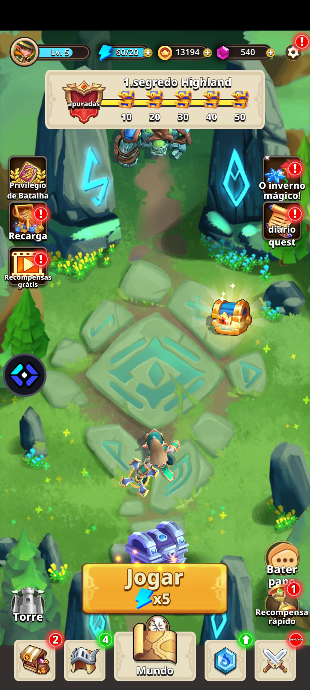
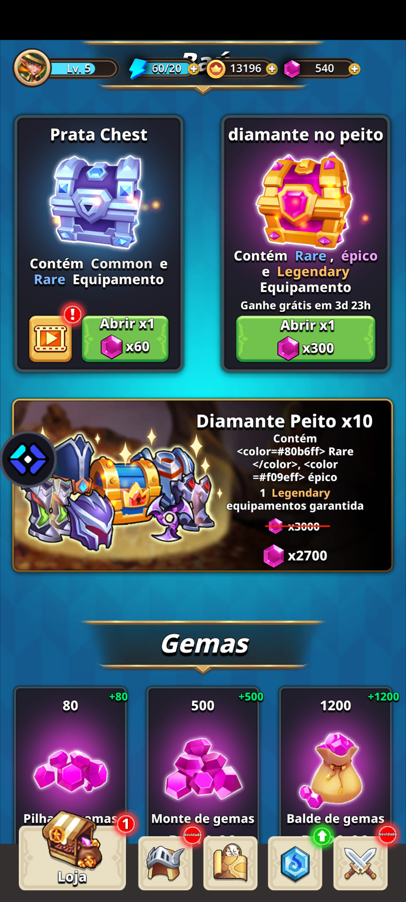

# Dungeon Kreeper

## Visão Geral
Dungeon Kreeper é uma plataforma para gerenciamento de mesas de RPG online, com rolagem de dados em tempo real, controle de sessões, personagens e permissões, utilizando Supabase como backend e React no frontend.

## Setup do Projeto

### Pré-requisitos
- Node.js 18+
- Yarn ou npm
- Supabase CLI (opcional para desenvolvimento local)

### Instalação
```bash
npm install
# ou
yarn install
```

### Rodando o Frontend
```bash
npm run dev
# ou
yarn dev
```

### Configuração do Supabase
- Configure as variáveis de ambiente SUPABASE_URL e SUPABASE_ANON_KEY no frontend.
- Para rodar localmente, utilize o Supabase CLI:
```bash
supabase start
```

### Configuração da OpenAI
- Obtenha uma chave de API da OpenAI em https://platform.openai.com
- Configure a variável de ambiente VITE_OPENAI_API_KEY no arquivo .env:
```bash
VITE_OPENAI_API_KEY=sua_chave_api_aqui
```
- Esta chave é utilizada pelo serviço npcAiService para geração de NPCs com IA.

### Migrações e Políticas RLS
- As migrações SQL estão em `supabase/migrations/`.
- Políticas RLS para segurança das tabelas, incluindo `dice_rolls`, estão em `20240901_rls_policies.sql`.

## Diagrama de Arquitetura

```
+-------------+     +-------------------+     +-------------------------+
|             |     |                   |     |                         |
|   Usuário   | <-> |  Frontend React   | <-> |  Supabase               |
|             |     |  (Vite + React)   |     |  - Auth                 |
+-------------+     +-------------------+     |  - Database (Postgres)  |
                    |                   |     |  - Storage              |
                    |  Componentes:     |     |  - Realtime             |
                    |  - DiceRoller     |     |  - Edge Functions      |
                    |  - MapSystem      |     |                         |
                    |  - NPCGenerator   | <-> |  Tabelas:               |
                    |  - SessionManager |     |  - sessions             |
                    +-------------------+     |  - dice_rolls           |
                            ^                 |  - characters           |
                            |                 |  - npcs                 |
                            v                 +-------------------------+
                    +-------------------+                 ^
                    |                   |                 |
                    |  OpenAI API       | <---------------+
                    |  - GPT-3.5-turbo  |     (Geração de NPCs)
                    |                   |
                    +-------------------+
```

- **Frontend:** React + Vite
- **Backend:** Supabase (Postgres, Auth, Storage, Edge Functions)
- **Realtime:** Supabase Realtime para rolagens de dados e sessões
- **IA:** OpenAI API para geração de NPCs

## Endpoints e Tabelas Principais

### Tabelas
- `users` (auth.users): Usuários autenticados
- `tables`: Mesas de RPG
- `table_participants`: Participantes das mesas
- `sessions`: Sessões de jogo
- `session_participants`: Participantes das sessões
- `characters`: Personagens
- `dice_rolls`: Histórico de rolagens de dados

### Edge Functions
- `/functions/dice-roll`: Endpoint para rolagem de dados

### Políticas RLS
- Apenas participantes podem ler rolagens de dados (`dice_rolls`)
- Apenas participantes/GM podem acessar sessões

## Testes E2E
- Cypress: testes em `cypress/e2e/`
- Fluxos testados: login, criação de mesa, permissões de sessão

## Deploy
- Configure variáveis de ambiente para produção
- Faça deploy do frontend e configure o Supabase

## Contribuição
Pull requests são bem-vindos!

---

## Configuração do Ambiente

### Requisitos
- Node.js v16+ e npm
- Conta no Supabase (para banco de dados e autenticação)

### Configuração das Variáveis de Ambiente

1. Crie um arquivo `.env` na raiz do projeto baseado no `.env.example`:

```
VITE_SUPABASE_URL=https://seu-projeto.supabase.co
VITE_SUPABASE_ANON_KEY=sua-chave-anon-do-supabase
```

2. Substitua os valores pelas suas credenciais do Supabase:
   - `VITE_SUPABASE_URL`: URL do seu projeto Supabase
   - `VITE_SUPABASE_ANON_KEY`: Chave anônima de API do seu projeto Supabase

Você pode encontrar essas informações no painel do Supabase em Configurações do Projeto > API.

### Instalação de Dependências

```bash
# Instalar dependências
npm install

# Iniciar o servidor de desenvolvimento
npm run dev

# Construir para produção
npm run build

# Executar testes
npm run test
```

## Sistema de Inventário

### Recursos Implementados

1. **Arrastar e Soltar**:
   - Implementado com `react-dnd` para mover itens entre inventários
   - Sincronização em tempo real via Supabase Realtime
   - Validação de permissões (apenas donos podem modificar seus itens)
   - Debounce de 500ms para evitar sobrecarga de requisições

2. **Otimização de Imagens**:
   - Conversão automática para WebP antes do upload
   - Lazy loading com placeholders via componente `ImageLoader`
   - Compressão de imagens para reduzir uso de armazenamento

3. **Paginação Infinita**:
   - Lista de mesas com carregamento infinito (10 itens por página)
   - Skeletons animados durante carregamento via TailwindCSS
   - Detecção de interseção para carregar mais itens automaticamente

### Configuração do Cron Job de Notificações

Para configurar o cron job que envia notificações de sessões agendadas:

1. **Acesse o Painel do Supabase**: Navegue até o SQL Editor.

2. **Execute o SQL para criar o cron job**:

```sql
-- Habilitar as extensões necessárias (se ainda não estiverem habilitadas)
create extension if not exists pg_cron;
create extension if not exists pg_net;

-- Criar o job para notificar sobre sessões próximas
select cron.schedule(
  'notify-upcoming-sessions',
  '*/30 * * * *', -- a cada 30 minutos
  $$
  insert into public.notifications (user_id, title, type, reference_id, reference_type, content)
  select 
    tp.user_id,
    'Sessão se aproximando',
    'session_reminder',
    t.id,
    'table',
    'Sua sessão de ' || t.name || ' começará em breve'
  from 
    public.tables t
    join public.table_participants tp on tp.table_id = t.id
  where 
    -- Lógica para determinar se a sessão está próxima
    t.weekday = to_char(now(), 'Day') 
    and t.time::time - current_time < interval '1 hour'
    and t.time::time - current_time > interval '0 minutes'
    and not exists (
      select 1 from public.notifications n 
      where n.reference_id = t.id 
      and n.type = 'session_reminder'
      and n.created_at > now() - interval '1 day'
    );
  $$
);
```

3. **Verificar o status do job**:
```sql
select * from cron.job;
```

### Schema do Banco de Dados

O sistema de inventário utiliza as seguintes tabelas:

#### character_inventory
| Coluna | Tipo | Descrição |
|--------|------|-----------|
| id | uuid | Identificador único do item |
| character_id | uuid | Referência ao personagem proprietário |
| name | text | Nome do item |
| description | text | Descrição do item |
| quantity | integer | Quantidade do item |
| weight | numeric | Peso de uma unidade do item |
| value | integer | Valor monetário (opcional) |
| type | text | Tipo do item (arma, armadura, etc) |
| rarity | text | Raridade (common, uncommon, rare, epic, legendary) |
| equipped | boolean | Se o item está equipado |
| image_url | text | URL da imagem do item |
| created_at | timestamp | Data de criação |
| updated_at | timestamp | Data da última atualização |

## Diagrama de Fluxo de Sessões

```mermaid
sequenceDiagram
    participant GM as Mestre do Jogo
    participant API as Supabase
    participant Player as Jogador
    
    GM->>API: Cria Mesa
    API-->>GM: Retorna ID da Mesa
    
    GM->>API: Convida Jogadores
    API-->>Player: Notifica sobre convite
    
    Player->>API: Aceita Convite
    API-->>GM: Notifica aceitação
    
    GM->>API: Inicia Sessão
    API-->>Player: Notifica início de sessão
    
    par Tempo Real
        Player->>API: Atualiza posição no mapa
        API-->>GM: Sincroniza posição
        GM->>API: Revela área do mapa
        API-->>Player: Atualiza visibilidade do mapa
    end
    
    GM->>API: Finaliza sessão
    API-->>Player: Notifica fim de sessão
```

## Screenshots das Telas Principais

### Painel do Mestre


### Mapa Tático


### Chat Durante Sessão


### Sistema de Combate


### Inventário


## Licença

MIT
